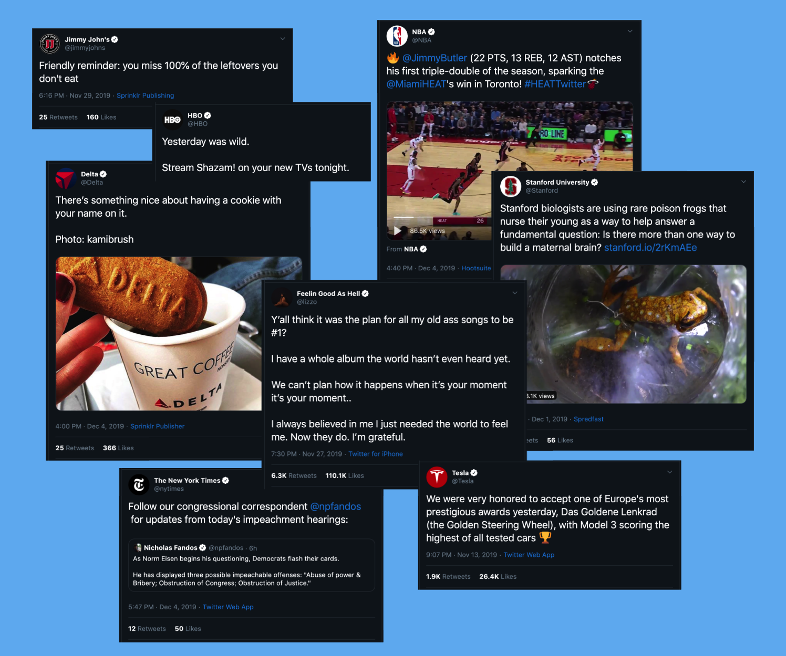
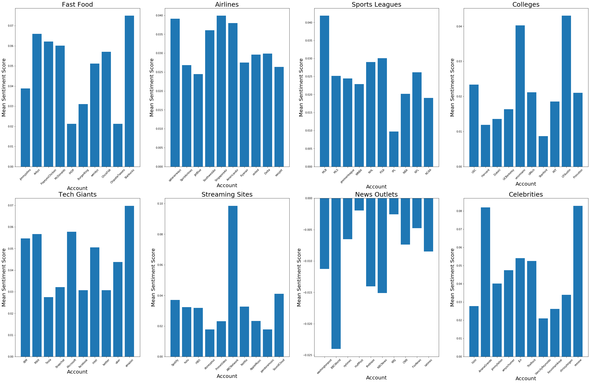

# twitter-spheres
Performing a categorical analysis of Twitter content using an 8 x 10 x 10000 tweet dataset and big data techniques

## the article
https://medium.com/@sejaldua/analyzing-twitter-spheres-through-nlp-techniques-748b0df10b6c

## dependencies (A.K.A. pip installs)
* `bokeh`
* `networkx`
* `netwulf`
* `afinn`
* `wordcloud`
* `nltk`
* `tensorflow`
* `keras`

## sample figures
#### collage of sample tweets that inspired our research question

#### logo chart depicting which accounts and categories we selected for our dataset

#### sentiment analysis

#### word cloud GIF

#### word frequency table

#### RNN training

